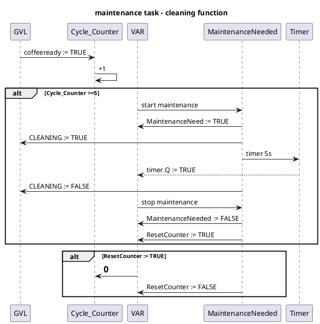

TASK 2: maintenance task

For the second task, the program has to handle the machine’s cleaning maintenance.

Every 5 cycles—that is, every 5 coffees made—the machine must be cleaned.
The cleaning function is automatically called by the maintenance task, and when it runs, the main task needs to wait an additional 8 seconds to ensure the machine is not operating during the cleaning process.

