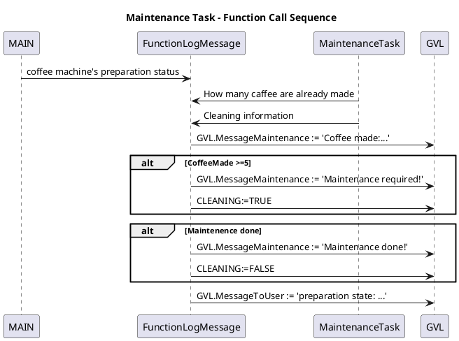

Function Call Sequence

The function is called by both tasks.
For the main task, the function informs the user about the machine’s preparation status — for example, when the machine is starting, when the water is filled, when the water is heated,..., and finally when the coffee ready and is available.

For the second task, the function displays a message indicating the number of coffees produced. When this number reaches five, the message “Maintenance required” is shown, and once the maintenance is completed, the message “Maintenance done” is displayed.

