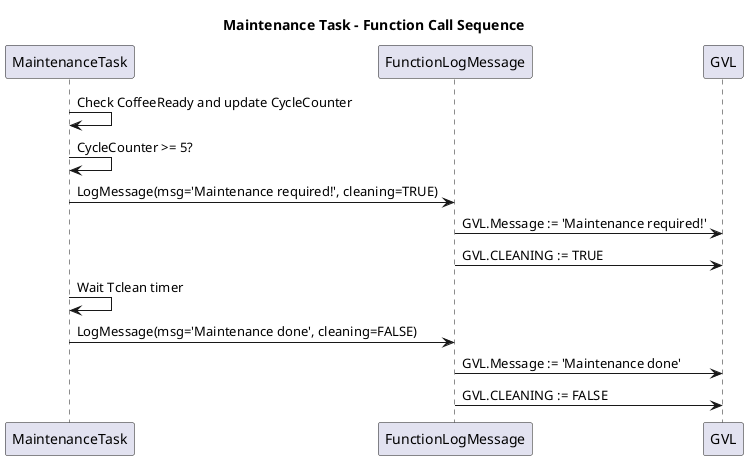

Function Call Sequence

```plantuml
@startuml
title Maintenance Task - Function Call Sequence


MaintenanceTask -> MaintenanceTask: Check CoffeeReady and update CycleCounter
MaintenanceTask -> MaintenanceTask: CycleCounter >= 5?
MaintenanceTask -> FunctionLogMessage: LogMessage(msg='Maintenance required!', cleaning=TRUE)
FunctionLogMessage -> GVL: GVL.Message := 'Maintenance required!'
FunctionLogMessage -> GVL: GVL.CLEANING := TRUE
MaintenanceTask -> MaintenanceTask: Wait Tclean timer
MaintenanceTask -> FunctionLogMessage: LogMessage(msg='Maintenance done', cleaning=FALSE)
FunctionLogMessage -> GVL: GVL.Message := 'Maintenance done'
FunctionLogMessage -> GVL: GVL.CLEANING := FALSE

@enduml
```